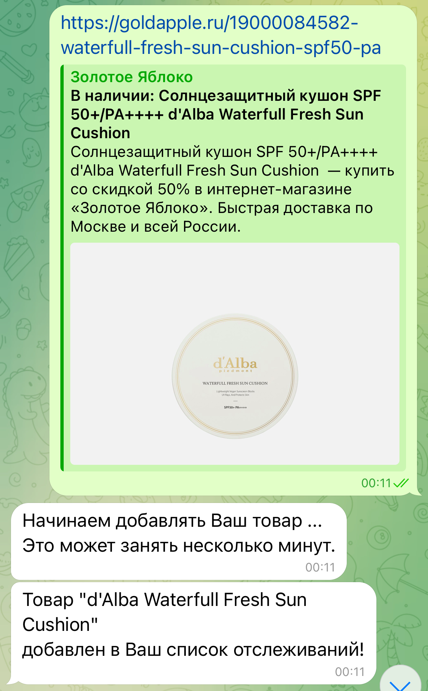

# Телеграмм-бот для получения актуальной цены товара

## Описание
Бот, который периодически проверяет цены на ваши товары и сообщает об изменениях.
## Основные особенности
- Возможность добавления товаров в список для отслеживания цены;
- Возможность получения информации об изменениях цены.
## Стек использованных технологий
+ Python 3.11
+ Aiogram
+ Asynco
+ Selenium
+ BeautifulSoup
+ Docker

## Демонстрация работы
+ Главное меню 

+ Меню добавления товара 

+ Список товаров пользователя 

+ Карточка товара 

+ Сообщение об изменении цены 

## Планируемые улучшения
+ Отслеживание размеров одежды/обуви;
+ Расширение списка магазинов, доступных для парсинга;
+ Получение статистики изменения цены.

## Автор

+ [Александр Непочатых](https://github.com/nepa27) 
